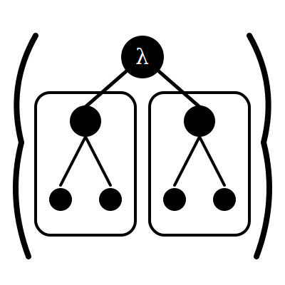

<h1 class="lona-hero__title">Lona</h1>

LISP Machines Never Died. They Evolved.

A next-generation operating system combining verified security, complete runtime transparency, and fault-tolerant distributed computing.

---

Lona is an operating system for developers who want full transparency and control over their computing stack. It unifies the strong security of the **seL4 microkernel** with the introspective power of a **LISP machine** and the fault-tolerant concurrency of **Erlang/OTP**. Programmed entirely in **Lonala**, a Clojure-inspired language, Lona lets you inspect, debug, and live-patch every layer of the system—from drivers to applications—without reboots, without opaque binaries, and without sacrificing security.

*Early development — interfaces may change.*

## Start Here

- **[Goals](goals/index.md)** — The vision, philosophy, and architecture of Lona
- **[Installation](installation.md)** — Run Lona on QEMU or physical hardware
- **[GitHub](https://github.com/sarnowsk/lona)** — Source code, issues, and contributions

## License

Lona is free software under the [GNU General Public License v3](license.md).

Copyright © 2025 Tobias Sarnowski.
